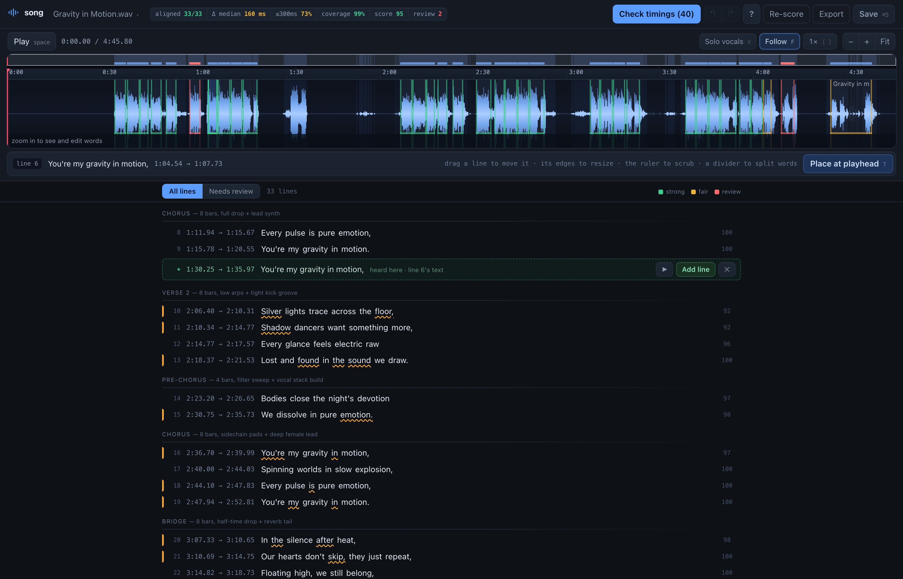
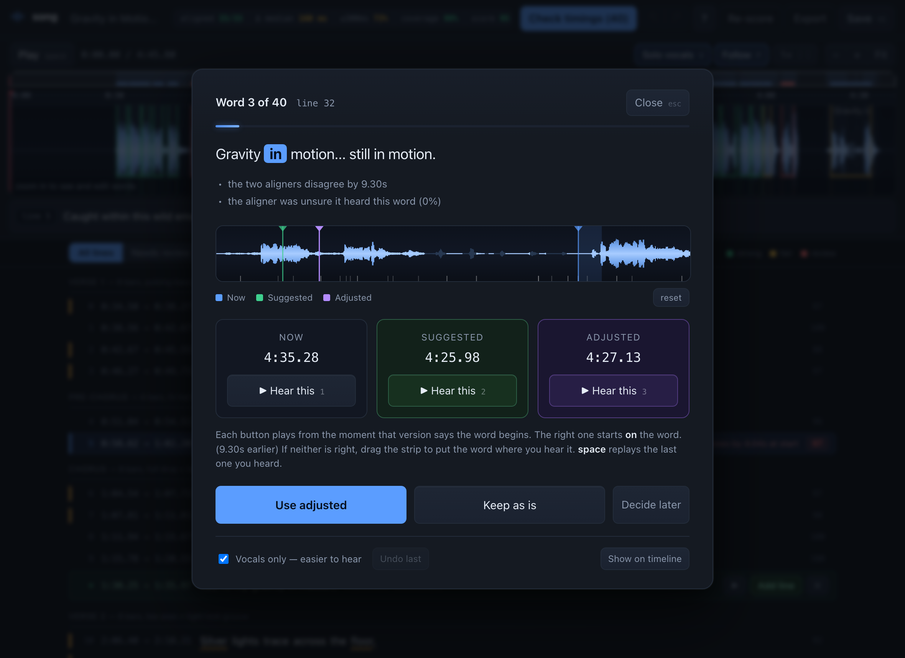
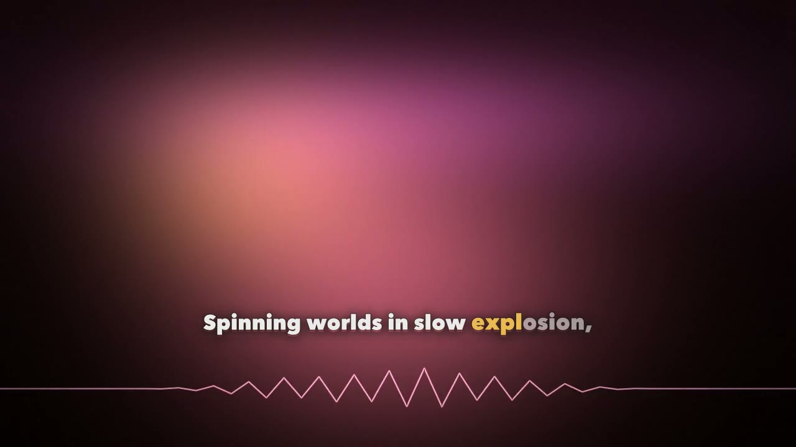

# song

[](https://github.com/nuterian/song/actions/workflows/tests.yml)

Turn an audio track plus a plain-text lyrics file into accurate, time-synchronized
lyrics — `.lrc`, word-level `.lrc`, `.srt`, `.vtt` — using only free, locally-run
open-source models. No API keys, no uploads, no per-track cost.

Built for AI-generated songs, where the lyrics are known exactly but the timing is
not. Then it renders the finished track to a karaoke video.

**[Try it in your browser →](https://jugalm.com/song/demo/)** · **[How it works, in full →](https://jugalm.com/song/)**

The demo is the real app against a real aligned track. Everything edits — drag a
line, drag a word boundary, run the guided check, hear both candidates for a
disputed word and drag a third onto the waveform. Only writing to disk needs it
running on your machine.



```bash
./setup.sh                       # one-time, ~5 min
./.venv/bin/python -m song  # opens the app at http://127.0.0.1:8420
```

Add your first track by dropping an audio file and a `.txt` into the app, or
align one straight from the command line:

```bash
./.venv/bin/python -m song song.wav lyrics.txt
```

## Why it is accurate

Because the words are known, this is **forced alignment**, not transcription — so a
chorus that repeats four times resolves by position instead of by guesswork. One
aligner is not enough, and there is no ground truth for an AI-generated song, so
three independent passes cross-examine each other:

1. **Demucs** isolates the vocal. Aligning against the stem rather than the mix is
   the single biggest accuracy win on dense productions.
2. **wav2vec2 CTC** anchors the structure with one global Viterbi pass, so
   instrumental stretches are absorbed as blanks instead of desynchronizing the
   rest of the song the way a whole-track Whisper pass does.
3. **Whisper** refines inside each ~20-second section. Coarse-to-fine: CTC for
   structure, Whisper for edges.
4. **A blind transcription** — told nothing — adjudicates where the two forced
   aligners disagree. It is the strongest single signal in the merge.

Every line then gets a 0–100 score from six independent signals, and the pipeline
re-aligns only the sections holding weak lines until an iteration changes nothing.
On the sample track:

```
  lines aligned             33/33
  median start disagreement 160 ms
  heard independently       33/33 lines
  vocal coverage            mean 99%, min 80%
  mean line score           94.5/100
  needs review              2 line(s)
```

The same score drives the UI, so review time goes exactly where the benchmark says
it should. Run against a deliberately degraded alignment it drops to 69.9 with 11
lines flagged — it discriminates.

## The review UI

One waveform: a minimap, a scrub bar, and the isolated vocal with draggable line
regions and word cells whose dividers snap to vocal onsets. Colour means *act
here* and nothing else. Two guided paths sit on top of it:

- **Check timings** walks the words two aligners disagree about, playing each
  candidate from the moment it claims the word begins. If neither is right, drag
  the card's own waveform strip to place a third.
- **Missing lines.** A lyrics file typed by hand drops things — usually a chorus
  repeat. The blind transcription already hears them; anything no line claims is,
  by construction, sung and absent from the lyrics. Proposed only when it matches
  a line you already wrote, so approving is a five-second listen, never proofreading.



## The video

Exact word timings are worth having because of what you can burn them into. One
command turns a reviewed track into an `.mp4`:

```bash
python -m song video workdir/my-track                # the whole track
python -m song video workdir/my-track --preview 1:04 # 25 seconds, to see it
```

Three lines sit at the bottom left — the one being sung, with the one before and
the one after smaller and faded either side of it. Each word grows, thickens and
fills with an accent colour as it lands, then settles back to ink behind you;
when the line changes the whole stack rises by one, on a curve rather than a
slide. That is ASS `\kf` karaoke drawn by libass, off the same timings the UI
edits, so there is no second renderer to keep in agreement with the first.

Level with it on the right, one zigzag line — drawn from the mix, weighted by
the bass and carrying the air band as a fine tremor, because a peak envelope
cannot tell a kick from a hi-hat and the difference is most of what a song
sounds like. Behind both, four fields of light drift and answer different parts
of the track, over a frame lit throughout and tinted by the section you are in,
keyed on its *name*, so every chorus looks the same.

Everything answers the mix with its best correlation at zero lag, and everything
it does is small — 6.9% of the available brightness over ten seconds. Nothing to
supply, no stock footage, no still image.



## Commands

```bash
python -m song song.wav lyrics.txt     # align + open the UI (default)
python -m song align song.wav lyrics.txt   # align and export, no UI
python -m song audit workdir/my-track      # repair + list what needs an ear
python -m song score workdir/my-track      # re-run the benchmark on your edits
python -m song export workdir/my-track     # rewrite lrc/srt/vtt
python -m song video workdir/my-track      # render karaoke.mp4
```

Flags: `--model large-v3-turbo`, `--no-roundtrip`, `--no-separate`, `--force`,
`--max-iterations N`.

## Output

Everything lands in `workdir/<track-slug>/`: `lyrics.lrc`, `lyrics.word.lrc`
(per-word, for karaoke), `lyrics.srt` / `.vtt` for `ffmpeg -vf subtitles=`, plus
`project.json` — word timings, per-line scores and the scorecard. `song video`
adds `lyrics.ass` and `karaoke.mp4`, and caches the beat grid as `beats.json`.

Lyrics input is plain text — one line per lyric line, a blank line between
sections, and a header naming each one. `[Verse 1]`, `Chorus:`, `(Bridge)` and
`Verse 1 (8 bars, pulsing bass)` all parse; the note in parentheses is kept as
structure and never aligned as a lyric.

```
Verse 1 (8 bars, pulsing bass)
Light breaks through the skyline haze,
Feet find rhythm in endless maze,

[Chorus]
You're my gravity in motion,
```

Bring your own audio. `examples/lyrics.txt` is the full sample file.

## Notes

Roughly 5 minutes end-to-end for a 5-minute track on an M4 CPU, and about 13
more to render the video at 1080p (4 at `--height 720`). Models download once (~3 GB) to the usual torch/HF caches.
Demucs on Apple MPS is broken under torch 2.5 and Whisper hits unimplemented
sparse ops there, so it is CPU throughout.

## Tests

```bash
python -m unittest discover -s tests
```

110 tests over the logic that carries the claims — lyrics parsing, the
word-timing invariants, word-to-line mapping, the export formats, the
missing-line thresholds, and the karaoke arithmetic and layout — plus a guard that those
modules stay importable with no third-party package present at all, which is
what lets CI run them in seconds without installing anything.

## The hosted demo

`docs/demo/` is generated from a real workdir, never hand-copied, so it cannot
drift from the app it claims to be a copy of:

```bash
python tools/build_demo.py workdir/my-track
```

It writes the project, the analysis payload the server would have sent, the
cached audit, and the two audio previews re-encoded to 64 kbps mono. The page
sets `window.SONG_STATIC`, which points the same `app.js` at those files instead
of the API and turns off every action that would write.

## License

MIT — see [LICENSE](LICENSE).
