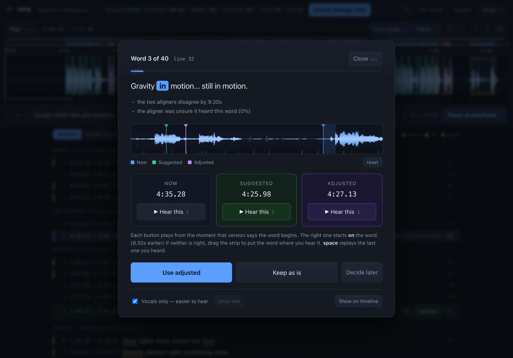
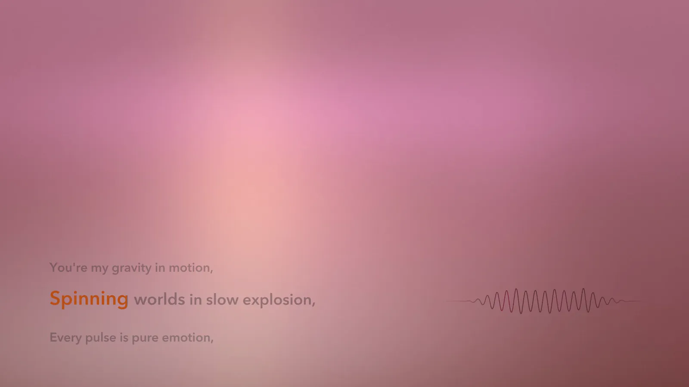

# song

[](https://github.com/nuterian/song/actions/workflows/tests.yml)

Turn an audio track plus a plain-text lyrics file into accurate, time-synchronized
lyrics — `.lrc`, word-level `.lrc`, `.srt`, `.vtt` — using only free, locally-run
open-source models. No API keys, no uploads, no per-track cost.

Built for AI-generated songs, where the lyrics are known exactly but the timing is
not. Then it renders the finished track to a karaoke video.

**[Try it in your browser →](https://jugalm.com/song/demo/)** · **[How it works, in full →](https://jugalm.com/song/)**

The demo is the real app against a real aligned track. Everything edits — drag a
line, take hold of either bound of any word, run the guided check, hear both
candidates for a disputed word and place a third yourself. Only writing to disk
needs it running on your machine.


```bash
./setup.sh                       # one-time, ~5 min
./.venv/bin/python -m song  # opens the app at http://127.0.0.1:8420
```

Add your first track by dropping an audio file and a `.txt` into the app, or
align one straight from the command line:

```bash
./.venv/bin/python -m song song.wav lyrics.txt
```

## Why it is accurate

Because the words are known, this is **forced alignment**, not transcription — so a
chorus that repeats four times resolves by position instead of by guesswork. One
aligner is not enough, and there is no ground truth for an AI-generated song, so
three independent passes cross-examine each other:

1. **Demucs** isolates the vocal. Aligning against the stem rather than the mix is
   the single biggest accuracy win on dense productions.
2. **wav2vec2 CTC** anchors the structure with one global Viterbi pass, so
   instrumental stretches are absorbed as blanks instead of desynchronizing the
   rest of the song the way a whole-track Whisper pass does.
3. **Whisper** refines inside each ~20-second section. Coarse-to-fine: CTC for
   structure, Whisper for edges.
4. **A blind transcription** — told nothing — adjudicates where the two forced
   aligners disagree. It is the strongest single signal in the merge.

Every line then gets a 0–100 score from six independent signals, and the pipeline
re-aligns only the sections holding weak lines until an iteration changes nothing.
On the sample track:

```
  lines aligned             33/33
  median start disagreement 160 ms
  heard independently       33/33 lines
  vocal coverage            mean 99%, min 80%
  mean line score           94.5/100
  needs review              2 line(s)
```

The same score drives the UI, so review time goes exactly where the benchmark says
it should. Run against a deliberately degraded alignment it drops to 69.9 with 11
lines flagged — it discriminates.

It is still one model checking another. `examples/gold/` holds the sample
track timed word by word against the stem's spectrogram, pitch track and
envelope, and `song bench` measures a project against it: per-word start and
end error as a distribution, split by the line score so the score's own
calibration is visible, and which of the singer's rests the alignment kept,
closed or invented. On the sample track the automatic pass benches at a 76 ms
median on word starts and 103 ms on ends; the three lines it gets most wrong
score 99.7 or better, which is the number that says why a gold file is needed.
`NEXT-smart-features.md` has the measurements behind everything below.

## The review UI

One waveform: a minimap, a scrub bar, and the isolated vocal with draggable line
regions and word cells whose dividers snap to vocal onsets. Colour means *act
here* and nothing else. Two guided paths sit on top of it:

- **Check timings** walks the words two aligners disagree about, playing each
  candidate from the moment it claims the word begins. If neither is right, drag
  the word's own bounds on the card's waveform strip to place a third.
- **Missing lines.** A lyrics file typed by hand drops things — usually a chorus
  repeat. The blind transcription already hears them; anything no line claims is,
  by construction, sung and absent from the lyrics. Proposed only when it matches
  a line you already wrote, so approving is a five-second listen, never proofreading.

The audit also repairs two things without asking, because the stem and the
song itself are unambiguous about them. A word that runs on after the
envelope says the voice stopped is pulled back ("ended 0.31 s after the voice
stopped"), and a chorus line whose word lengths sit far from its other
renditions is re-placed from the rendition nearest their median, by warping
the stem of one onto the other — that is what fixes the lines the score calls
perfect and gets wrong by half a second. A word whose length disagrees with
its repeats while they agree with each other goes into the queue as an A/B
choice. Every decision taken in the review card, and every bound dragged on
the timeline, is appended to `decisions.jsonl` in the workdir with the word's
features at the time, so that once a few hundred exist the queue can be ranked
by what people actually changed.



### Adjusting a word by hand

Click a word — in the lyrics, in a word cell, on the strip inside the Check
timings card — and both of its bounds appear as handles running the full height
of the waveform, with its start, length and end written above them. Every
surface that shows a word offers the same two handles, the same keys and the
same undo step, because they are all one operation underneath:

| | |
|---|---|
| drag a handle | moves that bound; snaps to a vocal onset, and shut against a neighbour it comes near (`alt` drags free) |
| `shift`-drag | takes the neighbouring word along, re-cutting a boundary without changing what sits either side |
| drag a word edge | the same edit on any edge in the cells, without selecting first |
| drag a time in the deck | scrubs that bound 4 ms a pixel (`shift` 1 ms) |
| `,` `.` | aim the arrows at the left / right bound |
| `←` `→` | move it ±50 ms — coarse |
| `shift` `←` `→` | ±10 ms — fine |
| `alt` `←` `→`, `tab` | previous / next word, rolling into the adjacent line |
| `S` `E` | put the left / right bound at the playhead |
| `⌘Z` | undo — a drag is one step, a burst of nudges folds into one |

**A word ends where the singer stops**, not where the next word starts, so a
line can hold a rest in the middle of it and both bounds are real, separate
numbers. Pull a bound inward and the word gets shorter, leaving a rest; push it
outward and it shoves the neighbour along rather than crossing it. The first
word's left bound is the line start and the last word's right bound is the line
end, which is why dragging either also moves the line's own edge.

That rest is what the karaoke video holds on — `karaoke.py` has always had a
branch for an unlit hold between two words, and until word ends became real it
could never fire. Gaps under 150 ms are swept through rather than held: the two
aligners disagree about where a word sits by 160 ms at the median, so a narrower
gap is inside their own error, and drawing it as a rest stutters the fill. On a
freshly aligned sample track that is 7 rests held and 14 gaps swept.
`lyrics.word.lrc` carries one timestamp per word and cannot encode a rest; it is
the one export that rounds them off.

A project aligned before this change has no rests in it — the ends were
flattened on the way to disk and cannot be recovered from the file. Re-run
`align` to get the aligners' own ends back, or open the rests you want by hand;
nothing else about the project changes.

Edits write themselves back a moment after you stop, rewriting `project.json`
and every export, and every write is re-scored, so the chips and the flags
always describe the timings under them; `⌘S` is the version that says so out
loud. A line you have placed by hand is scored without the agreement term -
you are the reference there, and `song bench` is what measures you.

## The video

Exact word timings are worth having because of what you can burn them into. One
command turns a reviewed track into an `.mp4`:

```bash
python -m song video workdir/my-track                # the whole track
python -m song video workdir/my-track --preview 1:04 # 25 seconds, to see it
```

Three lines sit at the bottom left — the one being sung, with the one before and
the one after smaller and faded either side of it. Each word fills with an
accent colour as it lands, syllable by syllable — the cuts come from the
strongest onsets inside the word, and ride on the word's own bounds so a
dragged word carries them — and swells for as long as it is held: the swell
arrives over a share of the word rather than over a fixed time, and then never
quite finishes arriving, so a sustained note is one long movement instead of a
pop and a wait. It settles back to ink behind you. When the line changes the
whole stack rises by one, on a curve rather than a slide. That is ASS `\kf`
karaoke drawn by libass, off the same timings the UI edits, so there is no
second renderer to keep in agreement with the first.

Level with it on the right, one smooth curve — drawn from the mix, weighted by
the bass and carrying the air band as a fine tremor, because a peak envelope
cannot tell a kick from a hi-hat and the difference is most of what a song
sounds like. It covers a second and a half of the track, so a beat has a place
on it: the stroke blooms warm where each beat falls, full strength on a
downbeat, and that bloom crosses the middle of the curve on the frame the beat
is heard. It dissolves into the picture at both ends rather than stopping.

Behind both, four fields of light drift and answer different parts of the track,
over a frame lit throughout and tinted by the section you are in, keyed on its
*name*, so every chorus looks the same. A fifth field answers the bar rather
than the level: it crosses the ceiling once per bar, right to left, swelling
from nothing at the downbeat and gone by the next one. Everything else here can
tell you a chorus is loud; that one can tell you where the chorus has got to.

1080p at 60 fps, h.264 at CRF 17, and the audio is muxed from the original file
at 256k — `song video` looks for it where the project last saw it and then
anywhere obvious nearby, because a workdir's cached mix is a ~130 kbps encode
made so a browser could scrub a waveform. `--audio` names it outright.

Everything answers the mix with its best correlation at zero lag, and everything
it does is small — 6.9% of the available brightness over ten seconds. Nothing to
supply, no stock footage, no still image.



## Commands

```bash
python -m song song.wav lyrics.txt     # align + open the UI (default)
python -m song align song.wav lyrics.txt   # align and export, no UI
python -m song audit workdir/my-track      # repair + list what needs an ear
python -m song score workdir/my-track      # re-run the benchmark on edits made elsewhere
python -m song bench workdir/my-track      # word error against a hand-timed gold file
python -m song export workdir/my-track     # rewrite lrc/srt/vtt
python -m song video workdir/my-track      # render karaoke.mp4
```

Flags: `--model large-v3-turbo`, `--no-roundtrip`, `--no-separate`, `--force`,
`--max-iterations N`. `bench` takes `--gold FILE` and `--json`; without
`--gold` it looks for `examples/gold/<track-slug>.project.json`.

## Output

Everything lands in `workdir/<track-slug>/`: `lyrics.lrc`, `lyrics.word.lrc`
(per-word, for karaoke), `lyrics.srt` / `.vtt` for `ffmpeg -vf subtitles=`, plus
`project.json` — word timings, per-line scores, the scorecard and the audit. `song video`
adds `lyrics.ass` and `karaoke.mp4`, and caches the beat grid as `beats.json`.

Lyrics input is plain text — one line per lyric line, a blank line between
sections, and a header naming each one. `[Verse 1]`, `Chorus:`, `(Bridge)` and
`Verse 1 (8 bars, pulsing bass)` all parse; the note in parentheses is kept as
structure and never aligned as a lyric.

```
Verse 1 (8 bars, pulsing bass)
Light breaks through the skyline haze,
Feet find rhythm in endless maze,

[Chorus]
You're my gravity in motion,
```

Bring your own audio. `examples/lyrics.txt` is the full sample file.

## Notes

Roughly 5 minutes end-to-end for a 5-minute track on an M4 CPU, and about 12
more to render the video at 1080p60 (6 at `--height 720`). Models download once (~3 GB) to the usual torch/HF caches.
Demucs on Apple MPS is broken under torch 2.5 and Whisper hits unimplemented
sparse ops there, so it is CPU throughout.

## Tests

```bash
python -m unittest discover -s tests
```

Over 230 tests over the logic that carries the claims — lyrics parsing, the
word-timing invariants, word-to-line mapping, the export formats, the
missing-line thresholds, the bench arithmetic, the word-end rule, the
repeat grouping, the syllable rule and the karaoke arithmetic and layout —
plus a guard that those modules stay importable with no third-party package
present at all, which is what lets CI run them in seconds without installing
anything. The handful that need numpy skip themselves where it is missing.

## The hosted demo

`docs/demo/` is generated from a real workdir, never hand-copied, so it cannot
drift from the app it claims to be a copy of:

```bash
python tools/build_demo.py workdir/my-track
```

It writes the project, audit included, the analysis payload the server would
have sent, and the two audio previews re-encoded to 64 kbps mono. The page
sets `window.SONG_STATIC`, which points the same `app.js` at those files instead
of the API and turns off every action that would write.

## License

MIT — see [LICENSE](LICENSE).
