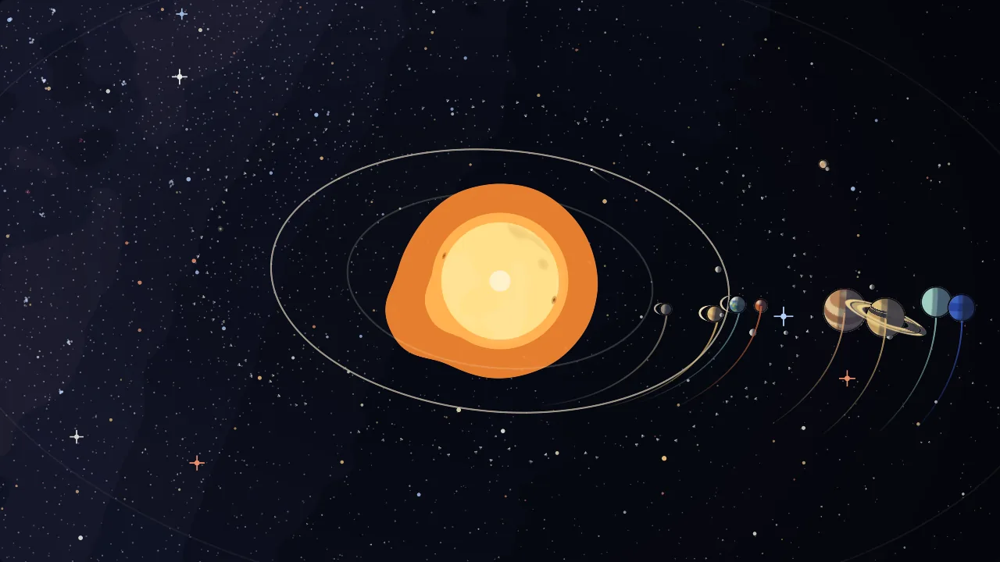
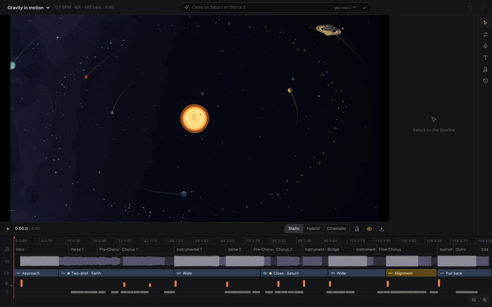

# song

[](https://github.com/nuterian/song/actions/workflows/tests.yml)

A music video for any song. Give it a track: it listens to the whole song, then draws it
as a solar system where every beat, note and word moves something. Then direct it
yourself, by hand or by asking, and export it. Free, open source, and made on your own
Mac: no account, no uploads, no keys.

**[Watch one in your browser](https://jugalm.com/song/video/)** · **[jugalm.com/song](https://jugalm.com/song/)**



It needs a Mac with Apple Silicon, Python 3.12 (`brew install python@3.12`), ffmpeg
(`brew install ffmpeg`) and about 10 GB of disk for the environments and the models.

```bash
git clone https://github.com/nuterian/song
cd song && ./setup.sh                        # once: two venvs, then asks about the models
visuals/.venv/bin/python -m visuals studio   # the studio, at http://127.0.0.1:8777
```

## What it makes

The solar system in three dimensions, the real planets against the real sky. Each part
of the picture is played by a part of the song, chosen for that song from what is really
in it: the pulse by the kick, the rings by the snare or clap, the stars by the hats, the
corona by the bass line, the planets by the synths' notes, the heart by the voice. The
song's form moves the camera. The words are placed where nothing in the picture crosses
them, and lit as they are sung. Everything is heard from the song itself, and the same
song makes the same video every time.

## The studio



- **Add a song** by dropping it on the studio or naming it on the command line (wav,
  flac, aiff, mp3, m4a, aac, ogg, opus), with its lyrics as a `.txt` if it has them. The
  first time, it is prepared: Demucs separates the stems, the words are timed, the song
  is listened to and the small models run. After that it opens in seconds.
- **Edit by hand** on the timeline: pick a shot, drag where one ends, choose bars and
  give them a shot, move a dial, correct the beat grid, name the sections. An edit is
  in the picture in about 1.4 s, and every change is a step in one history to undo.
- **Edit by asking**, in words ("a close shot on Saturn in the second chorus"), with a
  model running in [Ollama](https://ollama.com) on the same machine. This is optional:
  without Ollama everything else works and asking says to start it. The answer comes
  back as a proposal drawn on the timeline, to apply or discard. `gpt-oss:20b` edits
  best of the models measured, in about 7 s a request; it is its own download, through
  Ollama.
- **Export an mp4**: 1080p at 60 fps, wide (16:9) or tall (9:16, for a phone held
  upright), the camera you chose, the words burned in, the
  song's audio under it.
- **Export a loop for Spotify's Canvas**: a few of the song's liveliest bars, 8 seconds at
  most, 9:16, made to run round without a seam; no sound and no words.

## What it costs

- **Disk**: `.venv` 1.0 GB and `visuals/.venv` 1.1 GB, plus 7.8 GB of models: 1.9 GB
  for the video and Demucs, 5.9 GB for aligning lyrics (listed below).
- **Install**: `./setup.sh` took 1 min 46 s from a fresh clone with pip's cache warm,
  fetching 30 MB of packages. A first install also downloads two builds of torch and
  the rest, which was not timed. The models are a separate step it asks about.
- **Time**, on an M4 MacBook Air: aligning lyrics about 5 minutes for a 5-minute song;
  preparing it for the video about 7 (Demucs is half of that); rendering the mp4 at
  1080p60 runs at 45 frames a second, so about 7 minutes more.
- **Tested** on macOS on Apple Silicon only.

## What stays local

Everything. The songs, their stems, the edits and the renders stay on the machine; the
studio listens on 127.0.0.1; the edit model is Ollama's, on the same machine. There
are no accounts and no API keys. The network is used to install the packages and to
download each model once.

## How it works

Listening turns the stems into events timed to the millisecond (attacks, notes, the
beat grid) and small models say what they are (notes, chords, key, what a passage
sounds like, what a line is about). A director turns those into decisions - who plays
what, the acts, the shots, the moments the beat comes back - written as a direction
sheet a person or a model can edit, and the decisions are baked into channels a shader
reads frame by frame. `visuals/pieces/gravity/NOTES.md` has the piece, version by
version, with what was measured; `visuals/DESIGN.md` has the ideas the design rests on.

## The words

The words in the video are timed to the song by forced alignment, from the lyrics you
give it. Adding a song with its lyrics does this for you; it can also be run, checked
and corrected on its own:

```bash
./.venv/bin/python -m song song.wav lyrics.txt   # align, and open the review app at http://127.0.0.1:8420
```

Lyrics input is plain text: one line per lyric line, a blank line between
sections, and a header naming each one. `[Verse 1]`, `Chorus:`, `(Bridge)` and
`Verse 1 (8 bars, pulsing bass)` all parse; the note in parentheses is kept as
structure and never aligned as a lyric.

```
Verse 1 (8 bars, pulsing bass)
Light breaks through the skyline haze,
Feet find rhythm in endless maze,

[Chorus]
You're my gravity in motion,
```

Bring your own audio. `examples/lyrics.txt` is the full sample file.

How the timing is done, how accurate it is, and the app for checking and fixing it:
[song/README.md](song/README.md).

## Commands

`visuals` runs in `visuals/.venv`, `song` in `.venv`; `setup.sh` makes both. Each line
below starts with the one it needs:

```bash
visuals/.venv/bin/python -m visuals                          # the studio, with every song already prepared
visuals/.venv/bin/python -m visuals studio song.wav          # ...with a song in it
visuals/.venv/bin/python -m visuals make song.wav            # prepare a song without opening the studio
visuals/.venv/bin/python -m visuals edit song.wav "fewer solar flares"   # change its video by asking
visuals/.venv/bin/python -m visuals render song.wav --theme cosmos --camera hybrid   # an mp4 from the command line
visuals/.venv/bin/python -m visuals render song.wav --theme cosmos --tall            # the same, 9:16, 1080 by 1920
visuals/.venv/bin/python -m visuals render song.wav --theme cosmos --canvas          # a loop for Spotify's Canvas: its liveliest bars, 8 s at most

.venv/bin/python -m song song.wav lyrics.txt         # time the words, and open the review app
.venv/bin/python -m song align song.wav lyrics.txt   # time them, no app
.venv/bin/python -m song audit workdir/my-track      # repair, and list what needs an ear
.venv/bin/python -m song bench workdir/my-track      # word error against a hand-timed gold file
```

## Tests

```bash
python -m unittest discover -s tests
```

Over 230 tests over the logic that carries the claims (lyrics parsing, the
word-timing invariants, word-to-line mapping, the export formats, the
missing-line thresholds, the bench arithmetic, the word-end rule, the
repeat grouping, the syllable rule),
plus a guard that those modules stay importable with no third-party package
present at all, which is what lets CI run them in seconds without installing
anything. The handful that need numpy skip themselves where it is missing.

The video's tests run in its own venv:

```bash
PYTHONPATH=. visuals/.venv/bin/python -m pytest visuals/tests                  # all of them
PYTHONPATH=. visuals/.venv/bin/python -m pytest visuals/tests -m "not local"   # what CI runs
```

`local` marks the tests that need a GL context, the example song or its listening
cache. The rest need only numpy, scipy, soundfile, moderngl's import and node, which is
all CI installs for them, and run in a few seconds.

## Models and licences

Each is downloaded by the library that runs it, from its publisher, the first time it
is needed (or by `./setup.sh` when asked); none is in this repository.

| Model | For | Licence | Size |
|---|---|---|---|
| [laion/larger_clap_music](https://huggingface.co/laion/larger_clap_music) | video: what each passage sounds like | Apache-2.0 | 1.6 GB |
| [all-MiniLM-L6-v2](https://huggingface.co/sentence-transformers/all-MiniLM-L6-v2) | video: what each lyric line is about | Apache-2.0 | 92 MB |
| [Beat This!](https://github.com/CPJKU/beat_this) `final0` | video: beats and downbeats | MIT | 81 MB |
| [basic-pitch](https://github.com/spotify/basic-pitch) `nmp.onnx` | video: notes | Apache-2.0 | 0.2 MB |
| [SwiftF0](https://github.com/lars76/swift-f0), [lv-chordia](https://github.com/music-x-lab/ISMIR2019-Large-Vocabulary-Chord-Recognition) | video: the sung melody, chords (in their wheels) | MIT | under 3 MB |
| [Demucs](https://github.com/facebookresearch/demucs) `htdemucs` | both: the four stems | MIT | 84 MB |
| [wav2vec2 MMS_FA](https://pytorch.org/audio/stable/generated/torchaudio.pipelines.MMS_FA.html) | lyrics: the alignment's structure | CC-BY-NC-4.0 | 1.3 GB |
| [Whisper](https://github.com/openai/whisper) `medium`, `large-v3-turbo` | lyrics: aligning within sections, and retries | MIT | 1.5 + 1.6 GB |
| [faster-whisper-medium](https://huggingface.co/Systran/faster-whisper-medium) | lyrics: the blind transcription | MIT | 1.5 GB |
| [Silero VAD](https://github.com/snakers4/silero-vad) | lyrics: voice activity (in its wheel) | MIT | 2 MB |

All but one are under permissive licences (MIT, Apache-2.0) that are compatible with
this repository's MIT licence, and none is redistributed here. The exception is
MMS_FA: Meta publishes its weights under CC-BY-NC 4.0, so aligning lyrics with the
song tool as it stands is for non-commercial use. The video does not use it, but its
words come from that alignment.

## License

MIT, see [LICENSE](LICENSE).
